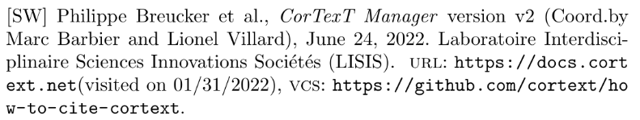
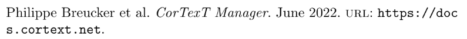
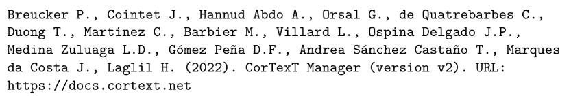

# How to cite CorTexT Manager

This project contains instructions for researchers on how to cite CorTexT
Manager on their academic works and for CorTexT Manager authors (developers,
coordinators, and so on) on how to maintain those instructions updated.

* Instructions for [CorTexT Manager users, researchers, etc](./how-to-cite-cortext.pdf).
* Instructions for [CorTexT Manager authors, developers, etc](./AUTHORS.md).

## How this project is structured?

* `CITATION.cff`: Citation File Format (CFF) file with data about the software CorTexT Manager
* `biblatex-software.bib`: BibLaTeX file with extension for Software for CorTexT Manager
* `codemeta.json`: CodeMeta file generated from `CITATION.cff`
* `bibtex.bib`: BibTeX file generated from `CITATION.cff`
* `apalike.apa`: APA file generated from `CITATION.cff` by `cffconvert` tool
* `how-to-cite-cortext.pdf`: Background about software citation, file formats, tools and example citting CorTexT
* `how-to-cite-cortext.tex`: LaTeX source-code of `how-to-cite-cortext.pdf` document
* `how-to-cite-cortext.bib`: BibTex file with the references used on `how-to-cite-cortext.pdf` document

## Quick-start guide

### Option 1) Cite CorTexT Manager with BibLaTeX

```bib!
@software{cortext_manager_v2,
  title = {CorTexT Manager},
  author = {Breucker, Philippe and Cointet, Jean-Philippe and Hannud Abdo, Alexandre and Orsal, Guillaume and de Quatrebarbes, Constance and Duong, Tam-Kien and Martinez, Cristian and Barbier, Marc and Villard, Lionel and Ospina Delgado, Juan Pablo and Medina Zuluaga, Luis Daniel and Gómez Peña, Diego Fernando and Andrea Sánchez Castaño, Tatiana and Marques da Costa, Joenio and Laglil, Hajar},
  abstract = {Over the last decades, whether documents, databases or online contents, including social media, the digital traces associated with human activities in society have experienced a sustained growth in volume and a wide diversification. They represent a renewed pl8ayground for social sciences and humanities, shifting the fields studied and renewing research questions and methods. CorTexT Manager started at this crossroads, within a research infrastructure aiming in particular at identifying and gathering methods in order to assist and structure the approaches of the researchers that use it.  The main goal of CorTexT Manager is that a social scientist, or any other user, could come with a research question and leave with the fruits of a computational method suited to their question. Cortext Manager facilitates the analysis of complex heterogeneous networks, crossing social networks with semantic networks. It also offers capabilities to identify place names mentioned in documents and to analyze the associated dynamics across the geographical space, as well as heterogeneous topic modeling methods.  While continuing to move forward on the scientific and technical fronts, CorTexT Manager’s functional design has been driven by a strong principle that still differentiates it: to offer users the ability to combine different methods and analyses without leaving the application.},
  date = {2022-06-24},
  month = {06},
  year = {2022},
  editor = {Marc Barbier and Lionel Villard},
  institution = {CorTexT Platform, Laboratoire Interdisciplinaire Sciences Innovations Sociétés (LISIS)},
  version = {v2},
  url = {https://docs.cortext.net},
  urldate = {2022-01-31},
  repository = {https://github.com/cortext/how-to-cite-cortext},
}
```

#### BibLaTeX Example



### Option 2) Cite CorTexT Manager with BibTeX

```bib!
@misc{cortext_manager_v2_bibtex,
  keywords = {cortext},
  author = {Breucker, Philippe and Cointet, Jean-Philippe and Hannud Abdo, Alexandre and Orsal, Guillaume and de Quatrebarbes, Constance and Duong, Tam-Kien and Martinez, Cristian and Barbier, Marc and Villard, Lionel and Ospina Delgado, Juan Pablo and Medina Zuluaga, Luis Daniel and Gómez Peña, Diego Fernando and Andrea Sánchez Castaño, Tatiana and Marques da Costa, Joenio and Laglil, Hajar},
  month = {6},
  title = {CorTexT Manager},
  url = {https://docs.cortext.net},
  year = {2022}
}
```

#### BibTeX Example



### Option 3) Cite CorTexT Manager with APA

```!
Breucker P., Cointet J., Hannud Abdo A., Orsal G., de Quatrebarbes C., Duong T., Martinez C., Barbier M., Villard L., Ospina Delgado J.P., Medina Zuluaga L.D., Gómez Peña D.F., Andrea Sánchez Castaño T., Marques da Costa J., Laglil H. (2022). CorTexT Manager (version v2). URL: https://docs.cortext.net
```

#### APA Example



## See also

* [Citation File Format (CFF)](https://citation-file-format.github.io)
* [BibLatex style extension for Software (biblatex-software)](https://www.ctan.org/tex-archive/macros/latex/contrib/biblatex-contrib/biblatex-software)
* [The CodeMeta Project](https://codemeta.github.io)
